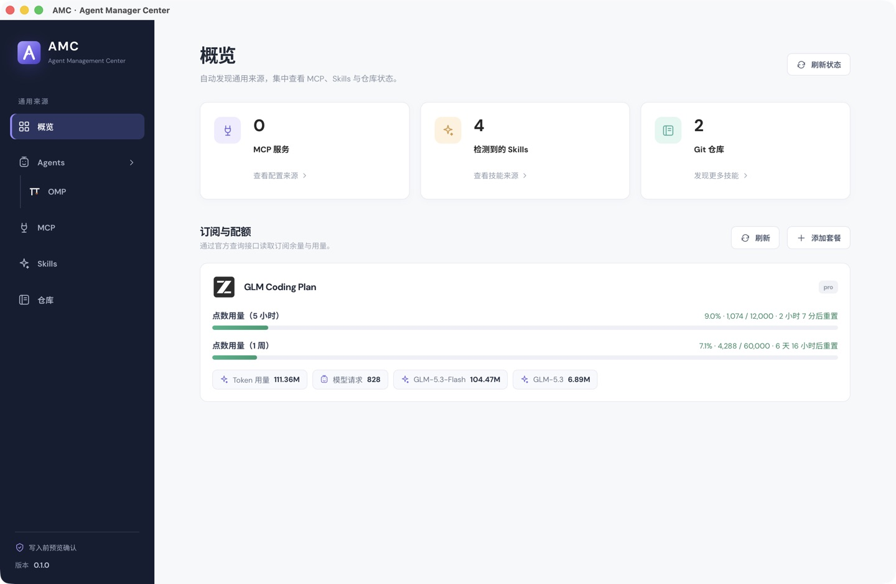
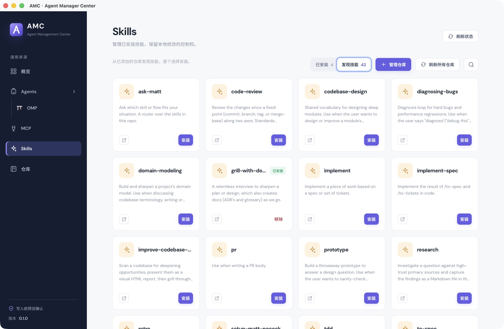
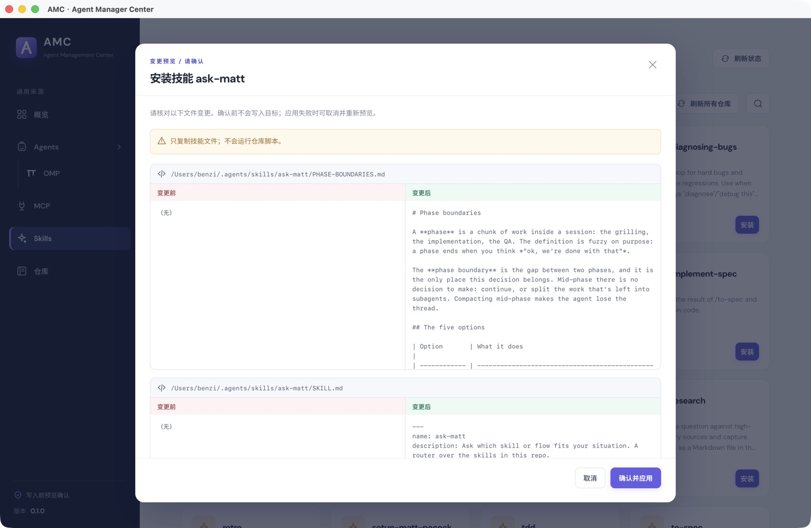
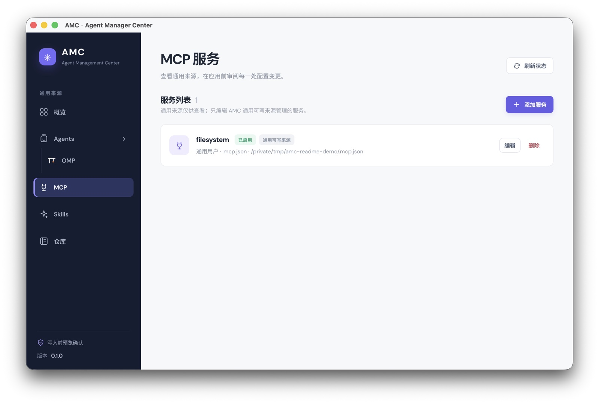

# AMC · Agent Manager Center

AMC 是 macOS 桌面端的 Agent 管理工具，集中管理 Skills、MCP，并查看 Agent 用量。

## 安装

从 [GitHub Releases](https://github.com/BenZinaDaze/amc/releases) 下载并安装 macOS 版本。

目前 DMG 未签名。将 AMC.app 复制到 `/Applications` 后，若 macOS 阻止打开，仅在确认下载来源可信时运行以下命令。它会递归清除应用的扩展属性（包括下载隔离标记），不会为应用签名：

```sh
xattr -cr /Applications/AMC.app
```

然后重新打开 AMC。

## 主要功能

- **Agents**：检测本机 OMP、Claude Code CLI 与 Codex CLI；Agents 页汇总所有 Agent 的请求数、Token 总量与已计价费用，并按模型列出明细。OMP 用量读取本地 stats.db，Claude Code 用量解析 `~/.claude/projects` 下的会话转录（支持 `CLAUDE_CONFIG_DIR`），同一请求经 resume/重试产生的重复行只计一次；Codex 用量解析 `~/.codex/sessions` 下的 rollout 转录（支持 `CODEX_HOME`），按 `token_count` 事件的每轮增量累计，并跟随会话内 `/model` 切换分别计价。
- **订阅与配额**：概览页卡片展示 GLM Coding Plan 的窗口配额与本周用量（模型用量按点数重置周期统计，接口无周期数据时回退滚动 24 小时），凭据仅在本地使用。
- **Skills**：添加远程 Git 仓库或本地来源，发现并选择安装技能；支持刷新、更新、回滚和卸载。
- **MCP**：查看已发现的服务及配置来源，预览并管理可编辑的 MCP 服务。

## 界面预览

概览



Skills 发现与选择安装



安装前的变更预览



MCP 服务管理


